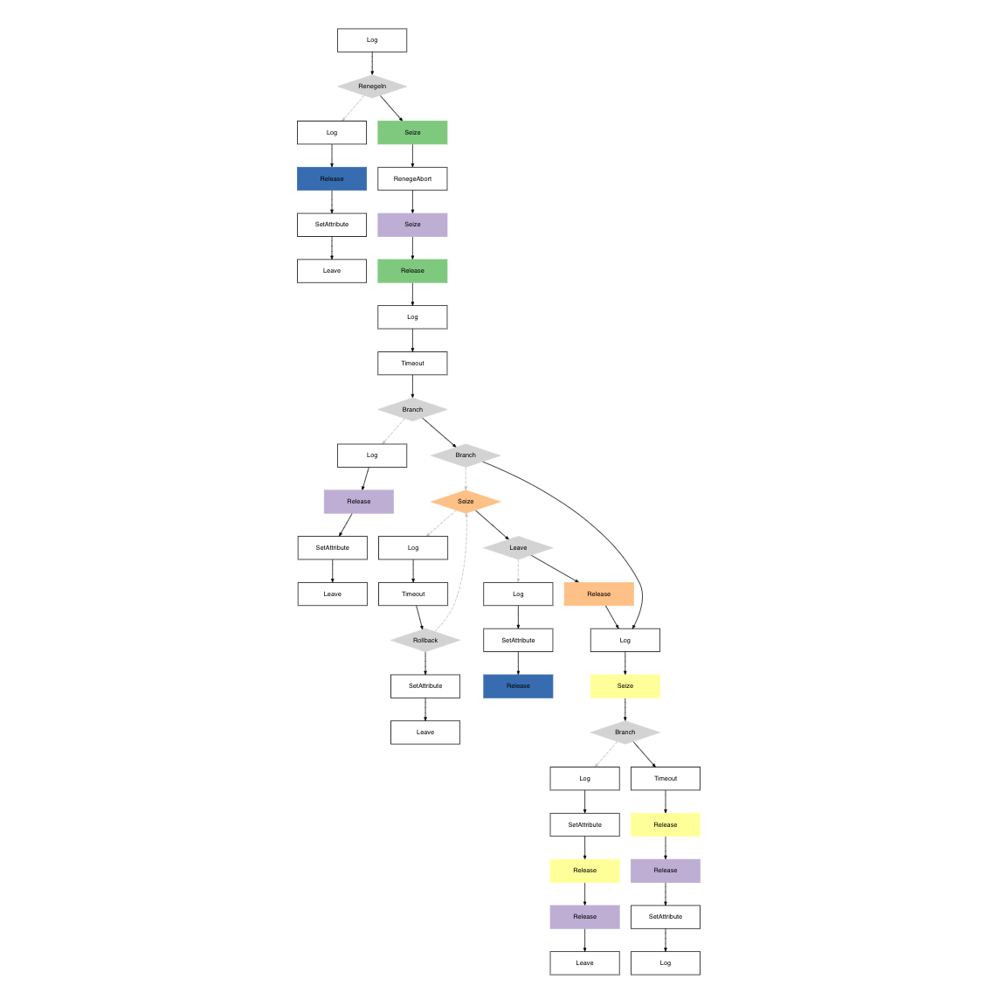

___

  

<h3 align="center">StepUp!</h2>

Welcome to the GitHub repository for the StepUp! Sneaker Store. This project was made for the Simulating and Modelling to Understand Change course at IE University.

  

## Table of Contents
<!-- TOC -->
  * [Table of Contents](#table-of-contents)
  * [Simulation ℹ️](#simulation-ℹ)
    * [Simulation Parameters 📊](#simulation-parameters-)
      * [Store Parameters](#store-parameters)
      * [Employee Parameters](#employee-parameters)
      * [Customer Parameters](#customer-parameters)
    * [Customer Journey 🚶‍♂️](#customer-journey-)
      * [1. _Arrival and Queueing_](#1-arrival-and-queueing)
      * [2. _Entering the Store_](#2-entering-the-store)
      * [3. _Browsing Inside the Store_](#3-browsing-inside-the-store-)
      * [4. _Asking for Assistance_](#4-asking-for-assistance)
      * [5. _Going to Pay_](#5-going-to-pay)
      * [6. _Paying and Leaving_](#6-paying-and-leaving)
        * [_A visualization of the customer journey:_](#a-visualization-of-the-customer-journey)
  * [Management Analysis 💼](#management-analysis-)
    * [Analysis Overview 🧑🏼‍💻](#analysis-overview-)
  * [Future Recommendations 📈](#future-recommendations-)
<!-- TOC -->

## Simulation ℹ️

Simulations are immensely powerful tools for understanding the complexity of the physical world, providing insight into its evolution and transformations. By creating a virtual environment that mirrors real-world conditions, simulations enable us to make informed management decisions or simply to gain a deeper understanding of ongoing processes.

In the 'StepUp: Sneaker Store Viability Simulator' project, we will employ a detailed simulation of a retail sneaker store, integrating realistic parameters that will lead to an authentic assessment of the store's potential profitability based on the data provided.

We will do the simulation in R using the simmer package. 

### Simulation Parameters 📊
The __StepUp!__ project resembles the dynamics of a sneaker retail environment through a series of defined parameters. The simulation crafts a scenario that involves the interaction between three main elements: the store's physical infrastructure, the employees, and the customers. Below are the detailed parameters guiding this simulation:

#### Store Parameters
* **Capacity**: The store's physical space is designed to accommodate up to 30 individuals at any given moment, ensuring a balance between a bustling atmosphere and customer comfort. 
* **Operating Hours**: Business operating time is from 9:00 am to 5:00 pm. As our simulation is tied to minutes, the resulting time of the simulation is 480 minutes.

#### Employee Parameters

* **Workforce Count**: Spatial limitations and the desire to maintain a comfortable shopping experience dictate the store's capacity. Given the size of the store, it can accommodate up to 30 customers simultaneously.
* **Counter Staffing**: There is no requirement for a minimum of employees to be present at the counter throughout the store's operating hours. The checkout system is automated. The store is equipped with a total of 3 automated checkout counters.

#### Customer Parameters
* **Queue Management**: When store capacity is reached, a queuing system is employed outside the store. Customers have either to wait outside the store or leave when tired of waiting in line. 
* **Customer Behavior**: The simulation incorporates customer decision-making, acknowledging that excessive queue lengths can result in potential customers choosing to leave rather than endure a prolonged wait.

### Customer Journey 🚶‍♂️
We need to understand the customer's path so that we can accurately simulate the store. The store's setup allows for different customer pathways so that customers can make different decisions. The customer journey is defined as follows:

#### 1. _Arrival and Queueing_
The customer arrives at the store and may leave the queue if the wait is too long.
#### 2. _Entering the Store_
Customers patiently wait to be the first ones in the queue and enter when store capacity is not reached.
#### 3. _Browsing Inside the Store_ 
Customers spend time browsing. Some customers may leave the store before browsing without buying anything.
#### 4. _Asking for Assistance_
Some customers may reach for employee assistance. If they try to get help but can’t, they will leave. Moreover, customers can leave the simulation after talking to an employee. Lastly, customers can follow the path without or without employee assistance. 
#### 5. _Going to Pay_
If the customer decides to buy, they go to the checkout. Customers may leave the simulation due to indecisiveness. 
#### 6. _Paying and Leaving_
Customers pay at the automated checkouts and leave.

##### _A visualization of the customer journey:_

---
_Notes: For more details on the customer journey (times that customers will be in a process, times that customers wait until leaving…), please refer to the markdown provided by the explained code: Store Simulation.Rmd._
___

## Management Analysis 💼
**_NOTE THAT THIS PART IS STILL IN PROCESS_**

Now that we have the simulation prepared, we can start analyzing the results as well as the different business applications that can be derived from the simulation.

To analyze the store, we will need to know more about the store. StepUp! is a physical store based in Madrid. The store wants to assess its profitability over a year, considering the current situation.
StepUp! has provided us with the following information:

StepUp! features four types of sneakers - Jay1, New2, Adverse3, and Pium4. Each model has the same cost and market price, though they vary in colors. The cost and selling prices are: Jay1 (Cost: 100, Price: 120), New2 (Cost: 200, Price: 210), Adverse3 (Cost: 80, Price: 90), Pium4 (Cost: 80, Price: 85).

Operational costs include:
* **Rent**: 5000€/month.
* **Salaries**: 1500€/month per full-time employee.
* **Cost of Sneakers**: Based on monthly sales.
* **Electricity**: 500€/month.
* **Internet**: 100€/month.
* **Maintenance and Repairs**: 300€/month.
* **Furniture and Equipment Amortization**: 100€/month.
* **Advertising**: 1000€/month.
* **Insurance**: 300€/month.
* **Cleaning Services**: 300€/month.
* **Software and Technology**: 200€/month.
* **Bank Transaction Fees**: 0.04% per transaction.
* **Other Fixed Costs**: Approximately 300€/month.
* **Other Variable Costs**: Approximately 350€/month.

_For the analysis and the results, please refer to the markdown provided: Business_Analysis.Rmd._

### Analysis Overview 🧑🏼‍💻
To thoroughly analyze the simulation and its results, we will delve into the following key areas:
1. **Break-even Analysis**: Identifying when revenues will equal expenses to predict store profitability.
2. **Cash Flow Analysis**: Evaluating cash inflows and outflows for operational sustainability.
3. **Sensitivity Analysis**: Examining the impact of varying business scenarios on profitability.
4. **Operational Efficiency Analysis**: Identifying areas to reduce costs and improve profit margins.
5. **Customer Analysis**: Assessing how the customer behave in the store.
6. **Growth Analysis**: Determining the scalability and expansion potential of the business model. 

## Future Recommendations 📈
For future development of the project, in order to add complexity to the simulation, we would like to add the following features:
1. **Dynamic Employees**: Implement shift changes for employees to reflect the variability in staffing levels throughout the day.
2. **Complex Counters**: Increase the complexity of counter resource management by including different types of counters such as express, self-checkout, or managed by staff.
3. **Calibrated Distributions**: Calibrate timing distributions (such as service times, inter-arrival times, and browsing times) using data to ensure they accurately represent the observed processes.
