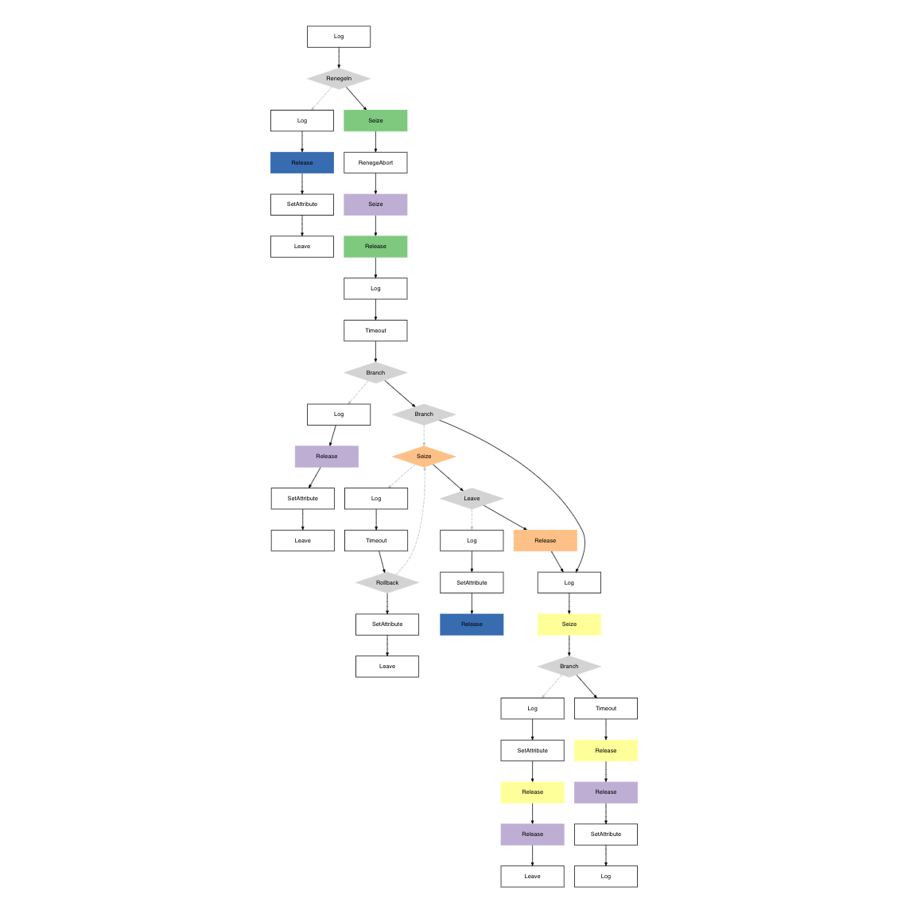

# StepUp! 👟

<!-- TOC -->
* [StepUp! 👟](#stepup-)
  * [Introduction to Simulation ℹ️](#introduction-to-simulation-ℹ)
  * [Simulation Parameters 📊](#simulation-parameters-)
    * [Store Parameters](#store-parameters)
    * [Employee Parameters](#employee-parameters)
    * [Customer Parameters](#customer-parameters)
  * [Customer Journey 🚶‍♂️](#customer-journey-)
<!-- TOC -->

Welcome to the GitHub repository for the StepUp! Sneaker Store. This project was made for the Simulating and Modelling to Understand Change course at IE University.

## Introduction to Simulation ℹ️

Simulations are immensely powerful tools for understanding the complexity of the physical world, providing insight into its evolution and transformations. By creating a virtual environment that mirrors real-world conditions, simulations enable us to make informed management decisions or simply to gain a deeper understanding of ongoing processes.

In the 'StepUp: Sneaker Store Viability Simulator' project, we will employ a detailed simulation of a retail sneaker store, integrating realistic parameters that will lead to an authentic assessment of the store's potential profitability based on the data provided.

We will do the simulation in R using the simmer package. 

## Simulation Parameters 📊
The __StepUp!__ project resembles the dynamics of a sneaker retail environment through a series of defined parameters. The simulation crafts a scenario that involves the interaction between three main elements: the store's physical infrastructure, the employees, and the customers. Below are the detailed parameters guiding this simulation:

### Store Parameters
* **Capacity**: The store's physical space is designed to accommodate up to 30 individuals at any given moment, ensuring a balance between a bustling atmosphere and customer comfort. 
* **Operating Hours**: Business operating time is from 9:00 am to 5:00 pm. As our simulation is tied to minutes, the resulting time of the simulation is to 480 minutes.

### Employee Parameters

* **Workforce Count**: Spatial limitations and the desire to maintain a comfortable shopping experience dictate the store's capacity. Given the size of the store, it can accommodate up to 30 customers simultaneously.
* **Counter Staffing**: There is a no requirement for a minimum of employees to be present at the counter throughout the store's operating hours. The checkout system is automated. The store is equipped with a total of 3 automated checkout counters.

### Customer Parameters
* **Queue Management**: When store capacity is reached, a queuing system is employed outside the store. Customers have either to wait outside the store or leave when tired of waiting in line. 
* **Customer Behavior**: The simulation incorporates customer decision-making, acknowledging that excessive queue lengths can result in potential customers choosing to leave rather than endure a prolonged wait.

## Customer Journey 🚶‍♂️
We need to understand the customers path so that we can accurately simulate the store. The store's setup allows for different customer pathways so that customers can make different decisions. The customer journey is defined as followed:

### 1. _Arrival and Queueing_: 
The customer arrives at the store and may leave the queue if the wait is too long.
### 2. _Entering the Store_: 
Customers patiently waits to be the first one in the queue and enter when store capacity is not reached.
### 3. _Browsing Inside the Store_: 
Customers spend time browsing. Some customers may leave the store before browsing without buying anything.
### 4. _Asking for Assistance_: 
Some customers may reach for employee assistance. If they try to get help but can’t, they will leave. Moreover, customers can leave the simulation after talking to an employee. Lastly, customers can follow the path without or without employee assistance. 
### 5. _Going to Pay_: 
If the customer decides to buy, they go to the checkout. Customers may leave the simulation due to indecisiveness. 
### 6. _Paying and Leaving_: 
Customers pay at the automated checkouts and leave.

This is a visualization of the customer journey.

For more details on the customer journey (times that customers will be in a process, times that customers wait until leaving…), please refer to the markdown provided of the explained code: _Store Simulation.Rmd_.

